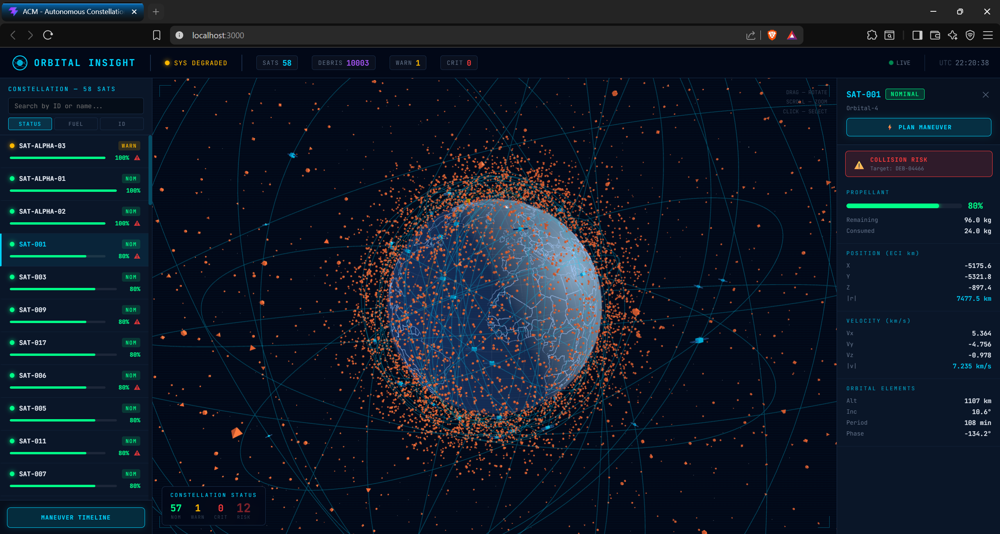

# Autonomous Constellation Manager (ACM)

*Orbital Debris Avoidance & Constellation Management System*

Welcome to ACM! We've built a multi-service orbital operations stack designed to track satellites and debris, predict conjunctions, autonomously plan collision-avoidance maneuvers, and visualize the entire fleet state through a live mission-control dashboard.



## Project Links & Demonstration

Before diving into the code, check out our project report and demonstration video where we walk through the live dashboard and autonomous evasion features:

- 📄 **[Project Report (Google Drive)](#)** *(Replace with your actual report drive link)*
- 🎬 **[Watch the ACM Demo Video (Google Drive)](#)** *(Replace with your actual video drive link)*

## The Problem

Over the past decade, Low Earth Orbit (LEO) has transformed into a highly congested space. We're dangerously close to the **Kessler Syndrome**—a scenario where a single collision generates a cloud of shrapnel, kicking off an unstoppable chain reaction of more collisions.

Right now, satellite collision avoidance is heavily manual. Ground operations face huge scalability limits, struggle with communication latencies (especially when satellites enter "blackout zones" without ground line-of-sight), and generally don't have a way to optimize fuel usage across an entire constellation simultaneously.

**Our Mission:** Transition away from manual, ground-reliant steering and build a scalable, onboard-ready autonomous pipeline. We focused on real-time space object monitoring, autonomous collision risk assessment, and fuel-optimal maneuver planning.

---

## What ACM Brings to the Table

We wanted a system that doesn't just react to problems, but actively calculates the best path forward. Here's what we implemented:

- **Handling Huge Telemetry Feeds:** We built an ingestion engine in Go that uses a highly concurrent worker-pool to process thousands of telemetry objects per second without breaking a sweat, backing everything onto MongoDB Atlas.
- **Seeing the Future (Conjunction Assessment):** We use a KD-tree algorithm (dropping complexity to $O(N \log N)$) paired with precise Time of Closest Approach (TCA) refinement and a Fast-Forward API to predict crashes before they happen.
- **Smart Evasions:** It's not enough to just dodge; you have to consider Line-of-Sight (LOS). We programmed the maneuvers to handle blind spots during communication blackouts gracefully.
- **Staying in the Slot:** If we move out of the way, we use predictive RK4 integration to safely return the satellite back to its assigned orbital slot limit (station-keeping).
- **Stretching the Fuel Budget:** Thruster burns are rigidly limited to 15 m/s with enforced 600-second thermal cooldowns. If fuel runs low, the system is smart enough to initiate a passive drift or active graveyard disposal strategy automatically.
- **Optimizing for Everything:** We run a multi-objective optimizer that actively balances fuel cost, maneuver time, and risk value dynamically using the formula $J = w_1 \cdot fuel + w_2 \cdot time + w_3 \cdot risk$.
- **Mission Control UI:** A buttery-smooth 60 FPS React dashboard hooks securely to our backend APIs to map Ground Tracks, render Conjunction Bullseyes, and chart the Maneuver Timeline in real-time.

---

## How It Works (The Architecture)

We decoupled the heavy data crunching from the complex orbital mathematics:

```text
React + TypeScript Dashboard ("Orbital Insight")
        |
        v
FastAPI Physics & Decision Engine  (:8000)
        |
        v
Go Adapter / Ingestion Layer       (:8080)
        |
        v
MongoDB Atlas (Central Data Backbone)
```

1. **Layer 1: Data Ingestion (Go):** Sits at the edge catching incoming ECI telemetry. It leverages lightweight goroutines and buffered channels to survive massive traffic spikes.
2. **Layer 2: Orbit Prediction & Risk (Python):** This is the brain. It uses KD-Trees to prune unnecessary pairwise checks and projects orbits forward via Adaptive-timestep 4th-Order Runge-Kutta (RK4) physics.
3. **Layer 3: Maneuvering (Python):** Calculates the actual evasions (Hohmann transfers, Radial burns, Plane Changes) natively inside the RTN frame, figuring out the best optimal path forward.

---

## The Physics Under the Hood

To make this realistic, simple Keplerian orbits weren't enough. We dove deep into orbital mechanics to get the math right.

### Reference Frames and State Vectors
Kinematic data lives in the **Earth-Centered Inertial (ECI)** coordinate system (J2000 epoch). The objects are defined by a standard 6D State Vector:

$$S(t) = \begin{bmatrix} x & y & z & v_x & v_y & v_z \end{bmatrix}^T$$

When we calculate a maneuver, we strictly port those calculations into the satellite's local **Radial-Transverse-Normal (RTN)** frame, find the solution, and then rotate it back to ECI to execute the command: $\Delta \vec{v}_{ECI} = [\hat{R} \ \hat{T} \ \hat{N}] \Delta \vec{v}_{RTN}$.

### Orbital Propagation & J2 Perturbation
We integrated numerical modeling to account for Earth's oblateness (the equatorial bulge), also known as the $J2$ Perturbation:

$$\ddot{\vec r} = -\frac{\mu}{|\vec r|^3}\vec r + \vec a_{J2}$$

Where $\mu = 398600.4418 \text{ km}^3/\text{s}^2$, $R_E = 6378.137 \text{ km}$, and the $J_2$ acceleration vector is applied mathematically at every time step.

### Crunching the Fuel (Tsiolkovsky Rocket Equation)
Satellites run on $50$ kg of mass ($m_{fuel}$) with an $I_{sp}$ of $300$ seconds. Every single execution eats into that budget governed strictly by the rocket equation:

$$ \Delta m = m_{current}\left(1 - e^{-|\Delta \vec v|/(I_{sp} g_0)}\right) $$

If the $\Delta V$ requested is larger than the required safe thrust constraints (max $15 \text{ m/s}$), the engine autonomously chunks the maneuver into bite-sized burns safely separated by rigourous **600-second thermal cooldowns**.

### Station-Keeping & Real-World Latency
- If an evasion knocks our satellite more than $10 \text{ km}$ from its designated slot, a service outage logs until our recovery integration maneuvers it back.
- **LOS Math:** Evasions incorporate physical geometric constraints against a Ground Station Network—it physically parses the dot product and arcsin elevations to know if it's connected.
- The system factors in a hard-coded $10$-second network signal latency and accounts for communications blackouts (over empty oceans) completely autonomously.

---

## Our APIs

The platform communicates via clean REST paradigms:
- **`POST /api/telemetry`**: The firehose endpoint ingesting ECI state vectors.
- **`POST /api/maneuver/schedule`**: Submits the final maneuver sequences validated against line-of-sight constraints, applying the $\Delta V$ directly against the available fuel reserves.
- **`POST /api/simulate/step`**: Our "clock ticker" advancing all objects mathematically to calculate future Conjunction Data Messages (CDMs).
- **`GET /api/visualization/snapshot`**: Provides high-density, flattened JSON packages stripped of bloat to keep our React frontend insanely fast, relaying active TCA countdowns and threat IDs.

---

## Frontend: "Orbital Insight" Visualizer

Our mission-control dashboard operates dynamically at 60 FPS directly within the browser, sidestepping DOM constraints by leaning on optimized 3D rendering.

- **The Ground Track Map:** A gorgeous 2D projection showing sub-satellite points, historical trails, eclipse shadow lines, and future predictions.
- **The Conjunction Bullseye Plot (Polar Chart):** Immediate visual representations of threat intercepts relative to their Time of Closest Approach (TCA).
- **Telemetry Heatmaps:** Fleet-wide fuel constraints mapping $m_{fuel}$ continuously across all active payloads.
- **Maneuver Timeline:** A Gantt scheduler charting the chronology of burn sequences and required thermal cooldowns seamlessly without overlapping conflicts.

---

## Judging & Evaluation (Deployment Requirements)

**CRITICAL:** ACM is built to operate flawlessly via containerized workloads, guaranteeing consistency against automated grading test benches!

1. **Dockerfile at Root:** Grading scripts will find our valid `Dockerfile` instantly at the repository root.
2. **Base Image:** Our initialization guarantees no dependency drift by utilizing `ubuntu:22.04` as the base image.
3. **Port Binding:** Port `8000` is strictly exposed binding to host `0.0.0.0` (not localhost) rendering all endpoints testable immediately.

### Automated Grading Setup (Raw Docker)

If you are grading using standard docker execution scripts, you can build and run the simulation using:

```bash
# 1. Build the image
docker build -t acm_submission .

# 2. Run the image, mapping port 8000 to the host
docker run -p 8000:8000 acm_submission
```

### Advanced UI Execution (Docker Compose)

For manual review where you want a complete environment containing the UI, Database, and Visualizer, just pull up our multi-stage architecture:

```bash
docker-compose up --build
```
*(You can then visit the frontend on your local browser!)*

---

*Built with passion by: Yashasvi Gupta, Aastha Shah, T Vishal, Sai Parcha*
